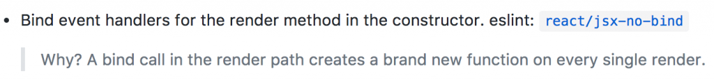
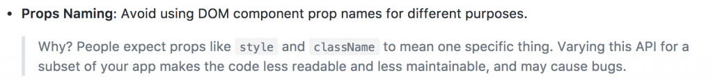
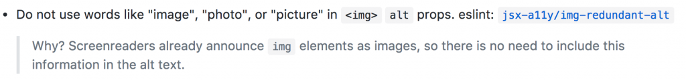
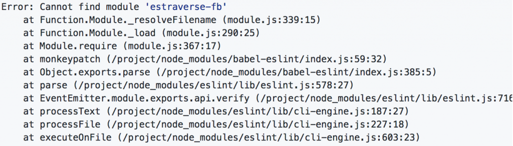
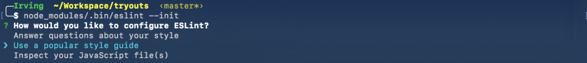
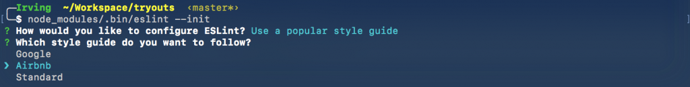
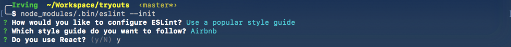
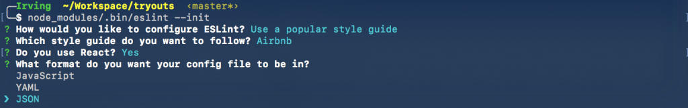
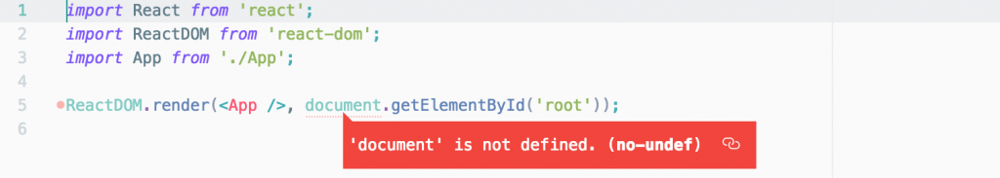
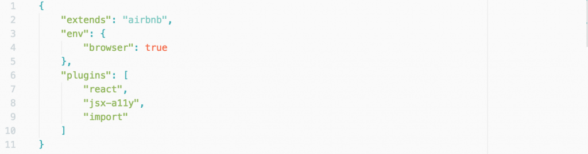

Some time ago I was working on a project and by accident I ended up looking at the [Airbnb React/JSX Style Guide](https://github.com/airbnb/javascript/tree/master/react), as you can see by it’s name that’s the Style Guide (some coding conventions) for React by Airbnb.

If you take your time and read through it, you will notice that the people at Airbnb has spent some time with it as all their decisions have some good reasons behind it, for example:

  
  

    Airbnb Style Guide Example 1
  

  
  

    Airbnb Style Guide Example 2
  

  
  

    Airbnb Style Guide Example 3
  

At that moment I decided it was not viable to implement those rules as my codebase was somewhat big and I was on a deadline. However time has passed since that day and today I’m starting a new project, and I decided to give the Airbnb Style Guide a shot.

If you see the page I linked at the start of this post ([this one here](https://github.com/airbnb/javascript/tree/master/react)) you will notice that it’s just the README of a github project and beside the rules themselves there is no info about how to implement them, and of course none is going to remember all those rules (right?).

##Linting
So in my journey to implement the Airbnb Style Guide I found there’s something called “Linting” (Yes, some of you will think “how comes this guy didn’t know what linting is” but at some point you didn’t know it either). So linting is basically the process of having some process check your codebase for stylistic or programming errors.

After finding out what linting is, i did the obvious thing: Google atom linting for Airbnb, and I found some guides over the Internet:

- [Setup ES6+Babel+JSX Linting with Atom](https://gist.github.com/darokel/90fe5c8ad8df5efcab6b)
- [Configuring Atom editor with ESLint and the AirBnB style guide rules](http://www.acuriousanimal.com/2016/08/14/configuring-atom-with-eslint.html)

However, I ended up running with troubles everytime I tried to lint my code while following those guides specially one about “estraverse-fb” and another about my react import being unable to resolve “import/no-unresolved”

  
  

    Cannot find module ‘estraverse-fb’
  

##ESLint

So after having a bad time trying to implement the linter I was about to give up and just start developing my project trying to be as consistent as I can, but while I was closing all those open tabs this one called my attention: ESLint

If you read the two guides I linked above you will notice that ESLint is all over the place, because it’s the main tool used to lint JS and JSX code

If you follow the Installation instructions:

  
  

    ESLint Installation Instructions
  

ESLint Installation InstructionsThis is what happens when you run eslint — init

- It asks you if you want to use a “popular styleguide”

  
  

    ESLint — init step 1
  

- It lets you pick the Airbnb Style Guide

  
  

    ESLint — init step 2
  

- It asks you if you use react

  
  

    ESLint — init step 3
  

- Then it ask you in what format you’d like to see your eslintrc

  
  

    ESLint — init step 4
  

Once you do this, you get ESLint up and running with the Airbnb Style Guide

##Linting in Atom

The only think left now is set up atom to tell you when you are screwing up your code, thankfully this is the easiest part of the process.

All you need to do is Install the package “linter-eslint”, Atom will ask you to install some dependencies and you are good to go!

##Free tips

Once you open you js files you will definitely see some errors.

The first one is an error telling you that JSX is not allowed in files with extension .js, the solution to this one is pretty simple: you just need to change your file extension from .js to .jsx

The second one should be at your index component and could look something like this:

  
  

    ESLint document is not defined
  

This one seems to be pretty crazy but it’s just ESLint not being aware of the browser global variables, and it can be solved by adding the browser environment to your eslintrc, which would look like this:

  
  

    eslintrc with browser environment
  

Keep On Hacking!

##TL;DR

1. Install ESLint, run eslint — init, select popular styleguide, select Airbnb
2. Install Atom package “linter-eslint”
