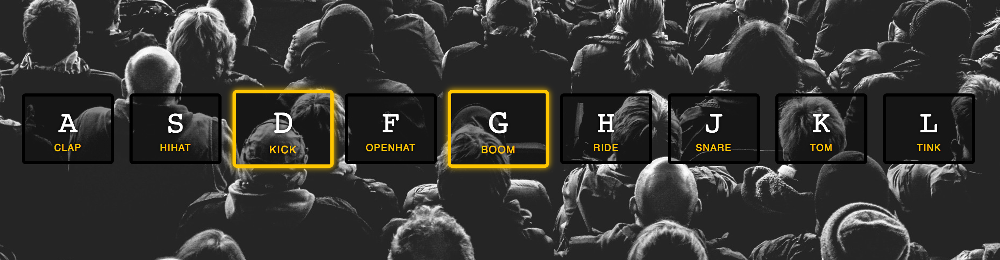

<div>
  
</div>

This is the first part of the Javascript 30 series I'll be posting. #JavaScript30 is a challenge by Wes Bos and the idea is to Build 30 things in 30 days with 30 tutorials with Vanilla JS.

Along this series I'll be sharing the approach I took and any interesting stuff I found in order to solve the challenges made by Wes Bos.

Let's see what interesting stuff is behind this Javascript Drum Kit.

##The idea

The idea is to build this simple app that displays some keys and will reproduce a sound once you click any of those keys. It'll also animate the key you pressed.

Wes Bos is giving us an initial file while all the html/css and will just add the functionality to it.

##The Process

To achieve this we will have to do something among the lines of:

1. Add an event listener for the keys
2. Reproduce the audio related to the pressed key
3. Animate the key element related to the pressed key

###Adding an event listener for the key press

The first thing I did was adding the event listener to the document and log its output

```javascript
  document.onkeypress = function (e) {
  console.log(e);
}
```

If we take a look at it's output we can notice there are at least 4 properties that would allow us to identify the keys: charCode, code, key and keyCode.

Now if we hit a key and then hit the same key with caps lock on you will notice that the charCode, keyand the keyCode are not the same. This is because both charCode and keyCode are the ASCII code for each letter and those happen to be different for uppercase and lowercase (you can take a look at the ASCII table here). However the difference between each uppercase key and its lowercase is 32 (always!), so we can rely on this to normalize the code.

If you take a look at the code provided by Wes you'll notice he's using the ASCII code for uppercase to identify each key element as well as the audio we should reproduce. So we could just check if the keyCode is greater than 96 (lowercase a starts at 97) and just take 32 away from it and we will be ok.

###onkeypress vs onkeydown

While looking at Wes solution I noticed he used onkeydown instead of onkeypress and there is some cool stuff behind the difference of this two listeners.

onkeydown will register an event for each key pressed no matter what. But onkeypress will only register an event for those keys that will print something. Meaning that hitting scape, caps lock or the arrow keys (this one can be useful) will register an event if you are using onkeydown but will be ignored if you are using onkeypress.
onkeydown will always contain the ASCII code for the uppercase of the key you hit.
That last point means that we can just use onkeydown instead of onkeypress and we can forget about substracting those 32 for the lowercase letters and we will always get the same keyCode for both uppercase and lowercase.

###Playing the audio

I have never messed around with audio in JS so I had to google this one (here's the answer at stackoverflow), and as you can see it's really simple once you have got they keyCode and the implementation would look something like:
```javascript
const key = e.keyCode;
const audio = document.querySelector(`audio[data-key='${key}']`);
audio.play();
```
Something interesting is that if you hit a key multiple times it won't replay the audio until it finishes the current reproduction. This means that browsers are smart enought to say "oh, I'm already playing this audio, no need to play it again". You can play different audios at the same time with no trouble. But if you want to replay an audio everytime you hit the same key you'll have to rewind it to 0:00 as there is no audio.stop() (Here is an stackoverflow answer that provides a hint).

###timeout vs transitionend Event

I'll be honest: I really liked this one, as I wasn't aware of this transitionend event until I saw Wes solution. My attempt to solve the issue of removing the 'playing' class involved using a timeout and it looks like this:

```javascript
setTimeout(function(){
  kbd.classList.remove('playing');
}, 70);
```

Where the '70' is the same amount of time specified in the transition-duration in the css, this means that the maintainability of this code is compromised, this a fairly simple app but if you think of a bigger app it would be annoying and the source of several bugs to keep the css and the js synced. But Wes came out with this transition event that doesn't require you to specify the duration of the transition in your js and it will just wait for the transition to end, it looks like this:

```javascript
const removeTransition = (e) => {
  if (e.propertyName !== 'transform') return;
  e.target.classList.remove('playing');
}
key.addEventListener('transitionend', removeTransition);
```

So TY Wes for this piece of knowledge!

##Code Blooper!

Remember when I said that there were at least 4 properties that would allow us to identify the keys? Well, before noticing that the difference between a lowercase letter and an uppercase one was always 32 (and way before discovering the difference between onkeypress and onkeydown), I was trying to figure out how to work with both uppercase and lowercase inputs. And I noticed that the attribute code was always the same regardless of it being a lowercase or uppercase letter. So I decided to map each of the codes to the expected number, it was something like this:

```javascript
const keyNumbers = {
  KeyA: 65,
  KeyS: 83,
  KeyD: 68,
  KeyF: 70,
  KeyG: 71,
  KeyH: 72,
  KeyJ: 74,
  KeyK: 75,
  KeyL: 76,
}
const key = keyNumbers[e.code];
```
That was it for Day 1! See you tomorrow for the next challenge.

Keep On Hacking!
