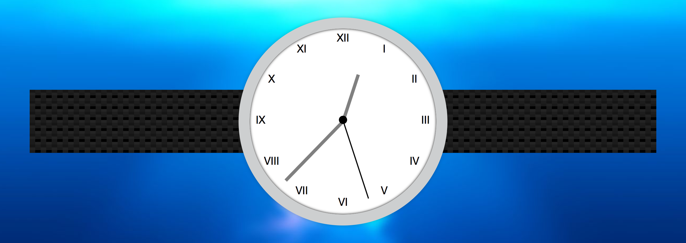

<div>
  
</div>

This is the second part of the Javascript 30 series I've been posting. #JavaScript30 is a challenge by Wes Bos and the idea is to Build 30 things in 30 days with 30 tutorials with Vanilla JS.

Along this series I'll be sharing the approach I took and any interesting stuff I find in order to solve the challenges made by Wes Bos.

Before we get to it: I'm a couple of days late with this one, I actually finished the challenge a couple of days ago, but was struggling finding time to write the post, so sorry about the delay!

Let's see what interesting stuff is behind this JS + CSS Clock.

## The idea

The idea is to build a Clock with CSS and animate its hands with JS according the browsers' time (actually Wes already built the clock we just need to add the functionality).

## The Process

To achieve this we will have to do something along the lines of:

Get the current date
Get the seconds, minutes and hour
Calculate how many degrees the hands should be rotated (based on the time)
Rotate the hands

###Getting the current Date

To get the browser's time JS provide us with an object called Date, when instantiated it contains the time at that moment (you can read more about it here).
It's worth knowing that the time that Date() gets you is based on the Unix Time and prefixing any instance of it with a + (Unary Plus Operator) will actually get you the amount of milliseconds since then.
```JavaScript
const time = new Date();
console.log(time)  // Sun Jul 09 2017 01:07:24 GMT-0400 (AST)
console.log(+time) // 1499576844919
```

###Getting the seconds, minutes and hour

Once you have an instance of date, getting the seconds, minutes and hour is super simple:

```JavaScript
const seconds = time.getSeconds();
const minutes = time.getMinutes();
const hours = time.getHours();
```
Keep in mind this values will be based on the user's time zone, for our current project this is what we want, but in the future you might want to get the UTC values in case you are storing a date to be displayed later (JS provides a set of getters for the UTC values).

### Calculating how many degrees the hands should be rotated

This one can be the most difficult if you are not used to do maths, but actually it isn't that hard. You just need to keep in mind that a circle has 360 degrees and divide that by the amount of seconds in a minute (60), minutes in an hour (60), hours in a day (24, but we will go with 12 because this is an analog clock).

Seconds: 360/60 = 6 this means we should rotate the hand 6 degrees for each second, so we just multiply the amount of seconds by 6. Also we will have to add 90 degrees because the initial position of the hands is horizontal, so we keep that offset to keep the clock starting at 12 o clock.

```javascript
const secondsDeg = Math.floor(seconds*6 + 90);
```
Minutes: we will use the same logic we applied before but we will also add the seconds that have passed for the current minute (hence the seconds/60).

```Javascript
const minutesDeg = Math.floor(((minutes + (seconds/60))*6 + 90));
```
Hours: This time we will use the exact same logic we used for the minutes, but we will multiply by 30 as our clock has 12 hours and 360/12 = 30 :

```Javascript
const hoursDeg = Math.floor(((hours + (minutes/60))*30 + 90));
```
### Rotating the hands

In order to rotate the hands we need to get each element, access its style attribute and set the transform:

```Javascript
const secondsHand = document.querySelector(".second-hand");
secondsHand.style.transform = `rotate(${secondsDeg}deg)`;
const minutesHand = document.querySelector(".min-hand");
minutesHand.style.transform = `rotate(${minutesDeg}deg)`;
const hoursHand = document.querySelector(".hour-hand");
hoursHand.style.transform = `rotate(${hoursDeg}deg)`;
```

### One last thing

If you look closely to the clock, you'll notice some weird stuff every time the seconds hand hits 0s (actually it will happen with any of the hands), this is because you are animating from somewhere around 444 degrees (just before the hands hits the 12) to 90 degrees. In order to avoid this you could just check when the hands are going to rotate to 90 degrees and remove the transition from the element and add it again after rotating the hand.

```Javascript
if (secondsDeg == 90) {
  secondsHand.style.transition = "none";
}
secondsHand.style.transform = `rotate(${secondsDeg}deg)`;
secondsHand.style.transition = `transition: transform 0.05s cubic-bezier(0.18, 0.15, 0.61, 2.08);`;
```

##Code Blooper!

I'm really sorry, there are no bloopers today.

That was it for Day 2! See you tomorrow for the next challenge.

Keep On Hacking!
