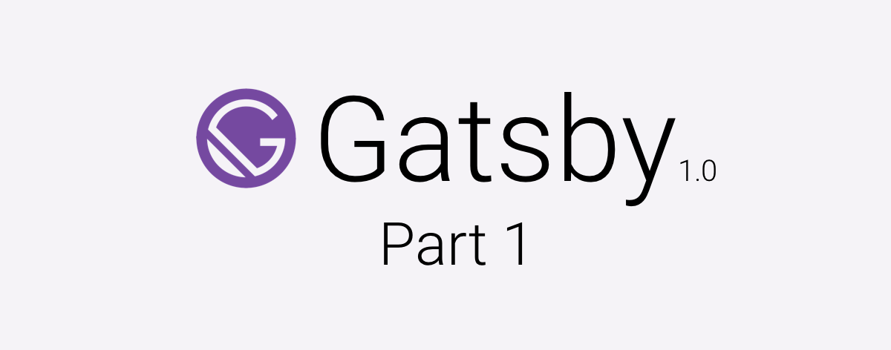

  

Ok, I haven't posted for a while (sorry about that) but there are 2 reasons for it:                                                                                                                           

1- I've been finishing my Angular2 course

2- Migrated the site to Gatsby 1.0 and decided to just start from a scratch as I didn't like the previous design.

About the first one, I'm planning to launch a project with Angular2 it'll be a PWA, I'm aware that it seems to be easier to launch a PWA with React or Vue but I want to take the challenge, build something with what I've learned and I think it might be a good idea to document the process of shipping a PWA with Angular2

And for the second point: the previous version of this site was built over a weekend trying to commit to get it done and start creating content, but I wasn't actually happy with the final result. So I started playing around with Sketch and came up with the site you are looking at right now. And I want to share with you all the amazing stuff I found along the way.

##The Design

It is inspired by the [cv template at w3schools](https://www.w3schools.com/w3css/tryw3css_templates_cv.htm). I really liked the concept of separating the content in cards so here we are. I'd like to thank [Raphael Guttenberger](https://blog.rphl.io/) for critiquing my design

##The Framework
Little recap about my site: this is actually the 4th version of my site (and the second to make it to production), the first one was built in WordPress, the second one was built in Jekyll, the third with Gatsby 0.12 and this one (with Gatsby 1.0).

I believe that everyone knows what WordPress is, so there is no need to talk about it.

Jekyll was the first static website generator, meaning that there is no interaction with databases or whatsoever nor server side processing for your pages so it's just content ready to be served. I really liked working with Jekyll but at that time I started to nitpicking all over the place and delayed the launch of the site several times and I ended up abandoning it.

Gatsby is also a static site generator BUT it's built for React! it's developed by [Kyle Mathews](https://www.bricolage.io/) (he's a really nice guy and you can find him on the reactiflux discord always willing to help). Gatsby 1.0 has a neat plugin system that allows you to extend its functionalities in amazing ways:

Want to use jss? there is a plugin for it

Is glamor your thing? there is a plugin for it

Would rather use typescript? there is a plugin for it

Want to create your web app manifest? there is a plugin for it

And the list goes on.

##Gatsby Starter

Gatsby also counts with a list of "starters" (templates for your site) that can help you get up and running faster. For this site initially I wanted to use the [Gatsby Material Starter](https://github.com/Vagr9K/gatsby-material-starter) but after playing around with it I found that React-MD was not going to help me achieve my design so I decided to use the [Gatsby Advanced Starter](https://github.com/Vagr9K/gatsby-advanced-starter) as it packs lots of nice stuff out of the box (GA, Disqus, SEO, among others). Both of this starters are made by [Ruben Harutyunyan](https://vagr9k.me/)

This will be it for today, stay tuned for the second part of this series where I'll comment on some cool stuff I found along the way and of course give you some insights on the actual development of the site with Gatsby
